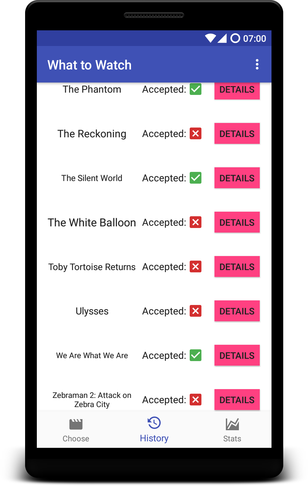
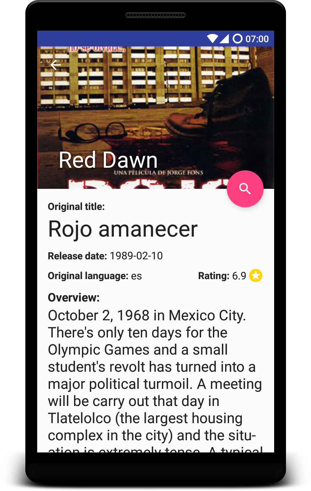
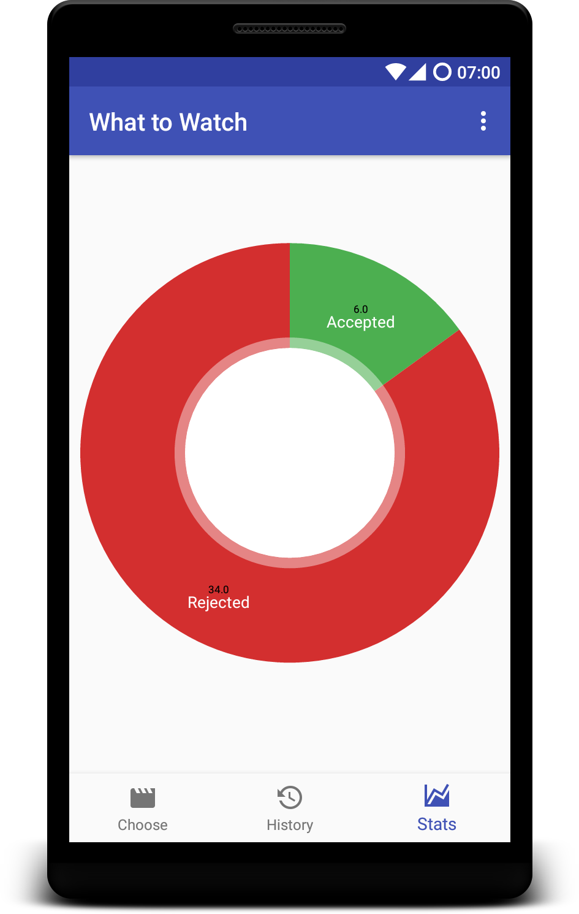

# What to Watch

## Introduction
Don't know *what to watch* tonight? This app helps you to decide! It selects a completely random movie for you, and you decide whether you like it or not...

   

## Contributing
Submit a pull request and I'll check it out as soon as I can.

## Installation

### Requirements
An Android device with API level 18 or higher `( 4.3 Jelly Bean =< )`

### Installation
Download the APK from [Releases](https://github.com/dim5/What-to-Watch/releases) and run it.

## Thanks
 - materialdesignicons.com and the people who submit there
 - Creators of the dependencies (see [build.gradle](./app/build.gradle))
 - themoviedb.org

## Author
Daniel Marczin ([danielmarczin.com](https://danielmarczin.com))

## License 
See [LICENSE.md](./LICENSE.md)
